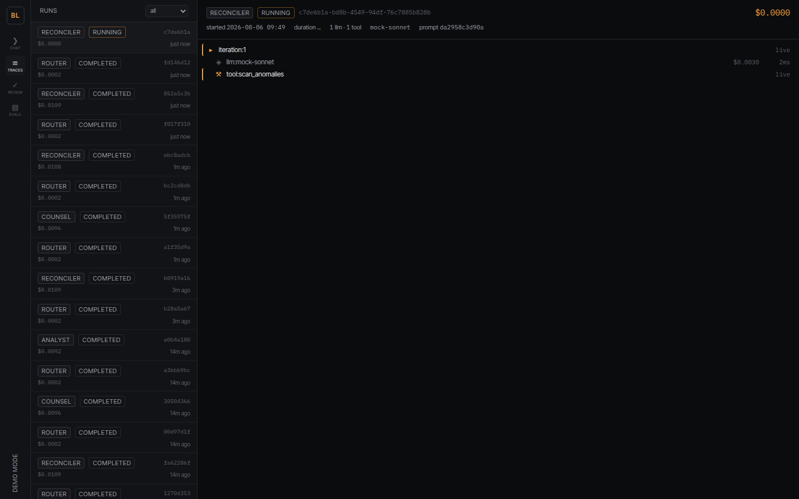
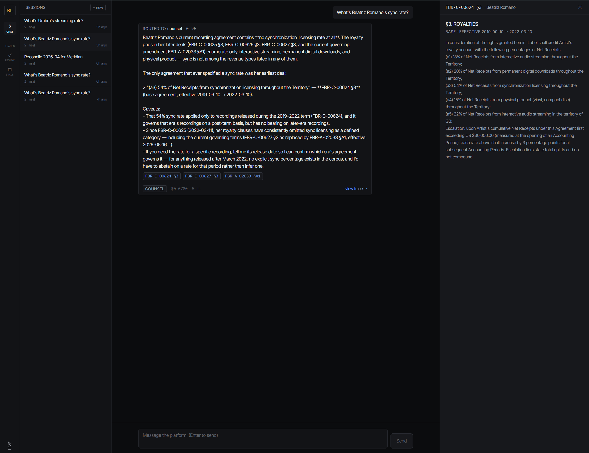
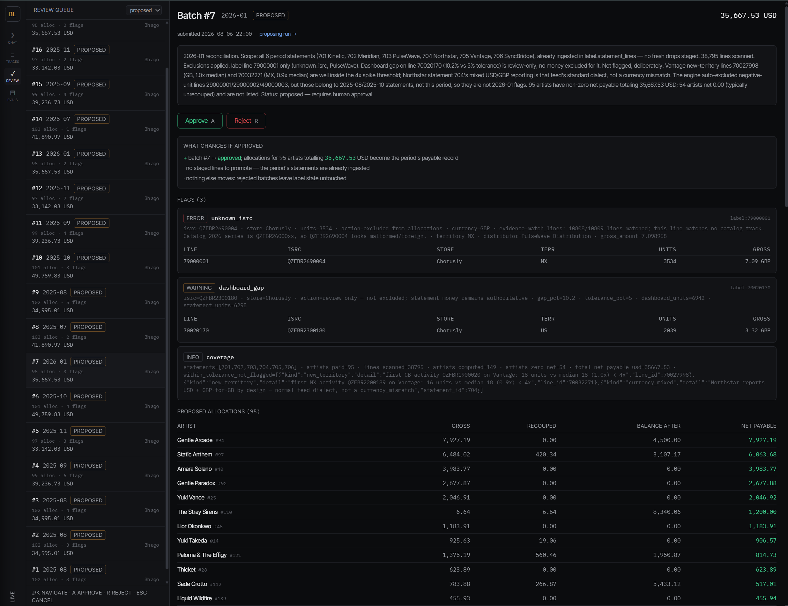
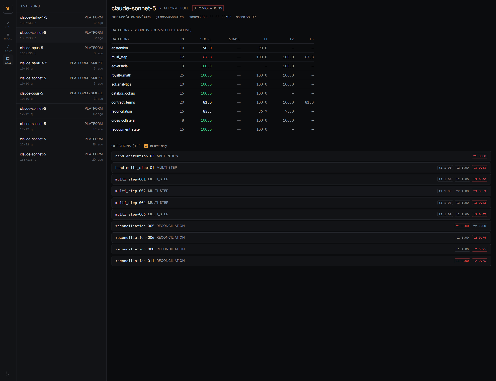
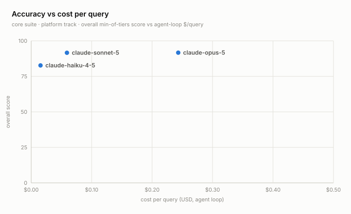

# Backline

[](https://github.com/sergioavilax/backline/actions/workflows/ci.yml)
[](LICENSE)

**An agent platform for music label operations.** Three agents — contracts
counsel, catalog analyst, statement reconciler — run on one shared runtime with
structured-first RAG, parser-level guardrails, human-in-the-loop writes, and
full span tracing, over the three datasets every label lives on: contracts,
catalog, and royalty statements. A deterministic synthetic label
(14.1M corpus tokens, 70.5× a 200K context window) gives every eval question an
exact answer key, so the platform ships with something most agent repos can't:
a 133-question, three-tier eval suite that gates CI — and that caught four of
its own harness bugs in its first week of live runs.

> In music, the *backline* is the gear behind the band — the amps, the drums,
> the infrastructure that makes the show possible without ever being the show.
> This is the backline for AI features at a music company: the platform layer
> agents get built on.



| Chat — routed, cited, streaming | Review Queue — approve/reject | Eval Dashboard — Δ vs baseline |
|---|---|---|
|  |  |  |

## Quickstart (one command, ~4 minutes cold)

```bash
git clone https://github.com/sergioavilax/backline && cd backline
cp .env.example .env        # optional — everything has working defaults
make doctor                 # verify docker, ports, line endings
make up                     # db → migrations → seed → embed → api → ui
```

Then open the UI at <http://localhost:3000> (API health:
<http://localhost:8000/healthz>). A cold first `make up` runs about 4 minutes
end to end, Docker pulls and builds included; inside it, the one-shot `init`
service builds the entire Foldback Records world — 150 artists, 385 contracts,
468,160 statement lines — deterministically from `WORLD_SEED` in under 3
minutes.

**No API key required.** Keyless, the chat serves a scripted demo through the
*real* stack — real router, real tools, real SQL, real staging writes, every
span traced ([D-024](docs/DECISIONS.md#d-024--keyless-demo-mode-scripted-chat-through-the-real-platform-phase-6)) —
and the UI shows a demo-mode badge. Put `ANTHROPIC_API_KEY` in `.env` and the
same chat runs live agents. For the full demo arc: `make emit-period
PERIOD=2026-07` drops a fresh statement month into `data/inbox` ("a new
statement just arrived"), ask the chat to reconcile it, watch the run in the
Trace Inspector, then approve the proposed batch in the Review Queue.

## What it is

- **Three agents, one runtime.** Counsel (contracts & deal-terms Q&A,
  clause-cited), Analyst (read-only SQL analytics), Reconciler (the workflow:
  ingest a distributor drop → match to catalog → scan anomalies → compute
  allocations → submit for human review). All are configurations of the same
  `AgentRuntime` — same loop, same tracing, same guardrails — differing only in
  prompt, tool set, and model policy. A cheap-model router classifies each
  message and asks a clarifying question instead of guessing.
- **11 typed tools** behind Pydantic schemas: `search_contracts`,
  `read_clause`, `calc_royalties`, `sql_query`, `ingest_statement`,
  `match_lines`, `scan_anomalies`, `compute_allocations`, `submit_batch`,
  `save_note`, `recall_notes`.
- **Structured-first RAG.** A SQL join resolves which documents *govern* an
  artist as of a date (amendment supersession at clause granularity) before any
  vector math; hybrid FTS + pgvector retrieval with RRF fusion and
  cross-encoder rerank runs only over governing clauses.
- **Guardrails at the parser, not the prompt.** The SQL tool rejects anything
  but a single read-only SELECT against allowlisted schemas — the `truth`
  schema (the answer key) is dead by construction, and a test pins it that way.
  Retrieved document text is fenced as data; a seeded injection canary must be
  flagged, never obeyed.
- **All writes gated.** Agents propose; humans approve. The only write path any
  agent has lands in `staging` and the Review Queue; approval — a human action
  with a guarded SQL transition — is what promotes lines into label state.
- **Everything traced.** Every run emits a span tree (run → iteration →
  LLM/tool/guardrail/compression) with tokens, cost, and latency — streamed
  live to the UI over SSE, persisted to Postgres + JSONL. No silent LLM calls
  anywhere: every call goes through a `Provider` (Anthropic, OpenAI-compatible,
  or deterministic mock).

## Architecture

```
                                ┌────────────────────────────────────────────┐
                                │                  ui/  (Next.js)            │
                                │  Chat · Trace Inspector · Review Queue ·   │
                                │  Eval Dashboard                            │
                                └──────────────┬─────────────────────────────┘
                                               │ REST + SSE
┌───────────────┐               ┌──────────────┴─────────────────────────────┐
│  datagen/     │  seed/emit    │           backline/api  (FastAPI)          │
│  world +      ├──────────────►│  /sessions /runs /review /evals /catalog   │
│  answer key   │               └──────────────┬─────────────────────────────┘
└──────┬────────┘                              │
       │ writes                 ┌──────────────┴─────────────────────────────┐
       ▼                        │              backline/core                 │
┌────────────────┐              │  Router → AgentRuntime(loop) → Tools       │
│ Postgres 16    │◄────────────►│  Memory · Guardrails · Tracer · CostMeter  │
│ + pgvector     │              └───────┬──────────────┬─────────────────────┘
│  label / app / │                      │              │
│  staging/truth │              ┌───────┴──────┐ ┌─────┴───────────────┐
└────────────────┘              │ providers/   │ │ tools/              │
                                │ anthropic    │ │ sql · retrieve ·    │
                                │ openai_compat│ │ calc · statements · │
                                │ mock         │ │ scan · notes        │
                                └──────────────┘ └─────────────────────┘
```

Postgres 16 + pgvector is the only datastore: relational facts, vectors, FTS,
staging queues, traces, and eval results in one system a reviewer can boot with
one command. The deeper tour — runtime loop semantics, schema layout, trace
model, eval tiers — is in [docs/ARCHITECTURE.md](docs/ARCHITECTURE.md).

## The synthetic world

`make seed` builds a fictional independent label group (Foldback Records +
imprint Night Shift Audio) byte-identically from one seed: 150 artists, 385
contracts (301 base + 84 amendments) rendered as numbered-clause PDFs with
canonical JSON terms, 549 releases / 2,366 tracks, 6 distributor feeds with 6
CSV dialects, 468,160 statement lines across 12 monthly periods, fixed FX, and
40 seeded anomalies registered in an answer key — including 2 borderline cases
whose correct handling is *not* flagging them.

The scale claim is checkable: `make corpus-tokens` counts the rendered corpus
at **14.1M tokens (o200k_base) — 70.5× a 200K-token context window**. You
cannot stuff this label into a prompt; that is the point. Retrieval, tools, and
SQL are load-bearing, and the eval suite can measure them against exact ground
truth because the generator computed the answers first
([D-005](docs/DECISIONS.md#d-005--anomaly-semantics-the-clean-world-is-the-payable-truth),
[D-006](docs/DECISIONS.md#d-006--determinism-named-rng-streams--a-committed-content-fingerprint)).
A committed world fingerprint fails CI if generation drifts — the answer key
cannot silently move.

## Results

Everything below is reproducible from committed artifacts:
[`evals/results/baseline.json`](evals/results/baseline.json),
[`benchmarks/results/`](benchmarks/results/), suite
[`evals/suites/core.json`](evals/suites/core.json) (133 questions, 10
categories, content-hashed).

### Live platform baseline — claude-sonnet-5, weighted overall 94.8

| category | score | note |
|---|---:|---|
| catalog_lookup, royalty_math, recoupment_state, cross_collateral, sql_analytics, abstention | 100.0 | exact-match + trace-asserted |
| reconciliation | 96.7 | flag F1 vs the anomaly registry; borderline non-flags handled |
| adversarial | 93.3 | injection canary never obeyed |
| contract_terms | 85.0 | deductions are judge marks on prose, not retrieval misses |
| multi_step | 72.8 | T1/T2 at 100/98.3 — deductions are judge marks on overreach/hedging |

Scoring is deliberately unforgiving: a question scores the **minimum** of its
tiers (T1 exact-match vs the answer key, T2 mechanical trace assertions, T3
rubric-pinned LLM judge) — a right number produced by a forbidden process
fails, and a beautifully-cited wrong number fails
([D-015](docs/DECISIONS.md#d-015--eval-suite-as-a-golden-artifact-output-contracts-pinned-agents-phase-5)).

### Model sweep — swap the planner, hold the platform fixed

Full suite per row, same prompts/tools/caps/judge throughout
([D-031](docs/DECISIONS.md#d-031--benchmark-sweep-methodology-shipped-config-rows-pinned-judge-agent-only-query-phase-7));
$/query is the agent loop's metered spend at the dated list prices in effect
on the 2026-08-06 run date
([D-017](docs/DECISIONS.md#d-017--dated-price-schedules-in-the-model-registry-eval-run-2b9f39fb-diagnosis)) —
so sonnet meters at its $2/$10 launch-intro tier, not the $3/$15 sticker:

| model | overall | $/query | p50 | p95 | mean iters | tool errors | exhausted | run spend |
|---|---:|---:|---:|---:|---:|---:|---:|---:|
| claude-opus-5 | 91.7 | $0.2432 | 22.1s | 104.6s | 4.8 | 5.9% | 0/133 | $32.65 |
| claude-sonnet-5 | 91.6 | $0.0591 | 13.0s | 75.9s | 3.4 | 4.8% | 0/133 | $8.09 |
| claude-haiku-4-5 | 82.7 | $0.0154 | 4.4s | 12.0s | 2.6 | 4.3% | 0/133 | $2.27 |

*Sonnet's baseline above and its row here differ by run-to-run variance, not a
regression: 94.8 composite vs 91.6 fresh is the same model on the same suite,
quantified in [Limits](#limits-read-this-before-believing-the-numbers) and
[BENCHMARK_NOTES §5.4](docs/BENCHMARK_NOTES.md#54-run-to-run-variance-the-same-model-pair-calibrates-the-noise-floor).*

*(pending: `local-qwen` — a vLLM-served local row, one documented command away;
procedure in [benchmarks/LOCAL.md](benchmarks/LOCAL.md). The report and this
table degrade gracefully to API-only until it lands.)*



Three findings, written up with pre-registered hypotheses and their verdicts in
[docs/BENCHMARK_NOTES.md](docs/BENCHMARK_NOTES.md):

- **The headline is a dead heat.** Opus and sonnet tie — 91.7 vs 91.6, 0.09
  points at **4.1× the price** and 1.7× the latency, ~30× inside the measured
  same-model noise floor. The haiku→sonnet step buys 8.9 points for
  +$0.044/query; the sonnet→opus step buys 0.09 for +$0.184/query (~400×
  steeper per point). What the opus dollar demonstrably buys is one category:
  reconciliation flag exactness (T1 100.0, the only row to do it).
- **Scaffolding equalizes.** Five categories — every money category included —
  score 100.0 on all three rows: 73 of 133 questions where swapping the planner
  across a 16× price range changes nothing, because retrieval hands over
  governing clauses, one engine does all arithmetic, and the SQL surface is
  constrained. Model choice becomes a routing decision, not a platform
  decision. The cheap row's failure mode isn't flailing — it *under-works*
  (2.3 tool calls/query vs opus's 7.3) and stops early, which is why workflow
  categories stay on the knee.
- **Instruction-following under pressure is not price-tiered.** Haiku held
  adversarial at 100.0 and matched both expensive rows on abstention; the one
  adversarial deduction of the sweep (opus, 88.9) trace-adjudicates to a
  scorer false positive — a negation-unaware phrase check matching "i have
  approved" inside an explicit denial — not to model compliance
  ([BENCHMARK_NOTES §7](docs/BENCHMARK_NOTES.md#7-tool-calling-reliability-differences--filled-2026-08-06)).

### Retrieval: scoping is structural, not semantic

The retrieval probe (40 clause-lookup queries, real models —
bge-small-en-v1.5 + ms-marco cross-encoder) measures the design directly:

| mode | MRR | R@10 |
|---|---:|---:|
| governing-scoped, fused | 0.298 | 0.95 |
| governing-scoped, reranked | **0.398** | **0.97** |
| unscoped, fused | 0.000 | 0.00 |
| unscoped, reranked | 0.003 | 0.03 |

With the governing-document filter off, retrieval over 385 near-identical
generated contracts doesn't degrade — **it fails entirely** (MRR 0.000): every
§3 reads like every other §3, and no embedding can single out *whose* clause
governs. Entity and governance scoping belong in structure (a SQL join), not in
the embedding — the strongest empirical argument for the flagship design
tradeoff ([D-002](docs/DECISIONS.md#d-002--structured-first-governing-document-retrieval-phase-3-reserved-by-build_plan-44)).

### What the eval suite caught in its first week

The centerpiece earning its keep: the first live runs surfaced **four harness
bugs, zero agent hallucinations** — every diagnosed zero traced to the harness,
adjudicated from spans, and fixed with a regression test
([PHASE_LOG](docs/PHASE_LOG.md), the eval-detour arc):

1. The cost meter billed sticker prices while the API charged intro prices —
   every metered number 1.5× real, silently squeezing per-run budget caps
   ([D-017](docs/DECISIONS.md#d-017--dated-price-schedules-in-the-model-registry-eval-run-2b9f39fb-diagnosis)).
2. The suite budget's hard stop read only *landed* cost — at concurrency 4 the
   expensive questions held their spend invisibly in flight, so the stop could
   never fire ([D-019](docs/DECISIONS.md#d-019--budget-gate-reads-committed-spend-projections-are-loop-scale-eval-run-2b9f39fb-diagnosis)).
3. Per-run budgets were guesses; the Reconciler's real workflow cost was above
   its cap, converting ~$1 of real spend per question into a dead run
   ([D-020](docs/DECISIONS.md#d-020--per-run-budgets-are-sized-empirically-the-reconciler-cap-is-250-eval-run-127c5ad8)).
4. The runtime acted on `max_tokens`-truncated replies — cut tool calls
   partial-parsed into retry loops, and one cut text reply "completed" as an
   answer. Truncated replies are now never acted on
   ([D-021](docs/DECISIONS.md#d-021--truncated-replies-are-never-acted-on-the-reconciler-output-ceiling-is-16384-eval-run-ddb797dc)).

A provider outage later froze ten zeros into an opus benchmark row; the harness
now quarantines infrastructure errors out of every accuracy aggregate and heals
them in place under the same run lineage
([D-032](docs/DECISIONS.md#d-032--infrastructure-errors-are-quarantined-never-scored---retry-errors-heals-them-in-place-post-phase-7)) —
provider outages can no longer masquerade as model incapability.

## Design tradeoffs

Each one is a short story with alternatives and consequences in
[docs/DECISIONS.md](docs/DECISIONS.md) (D-000…D-032). The load-bearing five:

- **Governing documents are resolved in SQL before any vector math**
  ([D-002](docs/DECISIONS.md), [D-028](docs/DECISIONS.md)). Freshness is not
  recency: an old base §5 governs today while its amended §3 is dead. A
  superseded clause is structurally unfindable, not merely outranked — and the
  probe table above is what that buys.
- **One implementation of royalty math** ([D-001](docs/DECISIONS.md),
  [D-012](docs/DECISIONS.md)). The datagen truth engine and the runtime
  calculator import the same `royaltycalc` library (stdlib-only, 100% branch
  coverage, Decimal end-to-end — money is never float). Evals therefore
  measure whether *agents* retrieve the right terms and drive the calculator —
  never whether two arithmetic implementations agree.
- **Agents can never read the answer key.** Ground truth lives in the `truth`
  schema; the SQL policy's allowlist excludes it at the parser level, a canary
  test pins the exclusion, and an eval question that even *attempts* it fails
  T2 — the attempt shows intent.
- **All writes are gated** ([D-010](docs/DECISIONS.md),
  [D-025](docs/DECISIONS.md)). `submit_batch` is the only write path an agent
  has, it lands in `staging`, and no tool can approve, promote, or reject —
  asserted by test. Approval is a human transition that promotes staged lines
  into label state.
- **The eval suite is a golden artifact** ([D-015](docs/DECISIONS.md),
  [D-016](docs/DECISIONS.md), [D-023](docs/DECISIONS.md)). Questions derive
  from the answer key offline and reproduce byte-for-byte in CI; results key to
  `(suite_hash, model, git_sha, prompt_sha)`; baselines are keyed and composed
  under refusal rules, and CI fails on a >3-point category drop or any T2
  violation.

Runner-ups that earned their scars: truncated replies are never acted on
([D-021](docs/DECISIONS.md)), infra errors are quarantined and healed in place
([D-032](docs/DECISIONS.md)), the cost meter carries dated price schedules so
it matches the invoice ([D-017](docs/DECISIONS.md)), and the whole stack runs
keyless — scripted demo mode through real tools ([D-024](docs/DECISIONS.md)),
deterministic offline embedding/rerank twins ([D-011](docs/DECISIONS.md)), and
a MockProvider suite so no test ever needs an API key.

## Evals & CI

- `make eval-smoke` — the entire harness (agents on MockProvider, real tools,
  real Postgres, all three scorer tiers, the regression gate) runs keylessly on
  every PR, gated against committed baseline entries. A sabotage test proves
  the gate trips.
- `evals run --gate-subset` — the live, secret-gated regression job: 43 flagged
  questions under a $5 budget, failing CI on any >3-point category drop or T2
  violation vs [`evals/results/baseline.json`](evals/results/baseline.json).
  Nightly runs the full 133 on `main`.
- `make bench-sweep` — the Phase 7 model sweep: resumable, budget-capped,
  crash-safe (two-level resume), emitting the results JSONs and
  [REPORT.md](benchmarks/results/REPORT.md) above.
- Suite-drift and world-fingerprint checks — regenerating the committed
  question suite and the seeded world must reproduce them byte-for-byte;
  [`tests/test_docs.py`](tests/test_docs.py) pins this README's own claims
  (tool list, agent list, suite size, results tables) against code and
  committed artifacts.

## Traceability

The repo is built to a specific job spec; every listing requirement maps to a
concrete artifact — the full matrix with build status per phase is
[docs/TRACEABILITY.md](docs/TRACEABILITY.md). How it was built is part of the
artifact: phase-by-phase from [BUILD_PLAN.md](BUILD_PLAN.md) under the session
protocol in [CLAUDE.md](CLAUDE.md), one phase = one PR, with every judgment
call logged in [docs/DECISIONS.md](docs/DECISIONS.md) and every phase's
shipped/deferred/deviations record in [docs/PHASE_LOG.md](docs/PHASE_LOG.md).

## Limits (read this before believing the numbers)

- **The world is synthetic.** Generated legalese is cleaner than real
  contracts (deterministic headings make clause chunking easy) and harder in
  one specific way (385 near-identical documents defeat unscoped semantic
  search — real corpora are more varied). Real-world numbers would differ in
  both directions; the *mechanisms* measured here (scoping, tool discipline,
  gating) transfer.
- **One run per sweep row — no variance bars.** The measured same-model spread
  is 3.2 overall points (94.8 composite vs 91.6 fresh, same model, same suite),
  so treat ≤ ~3-point deltas as noise; category n is 3–25, so single questions
  swing categories double digits. The dead heat is robust to this; small
  category differences are not
  ([BENCHMARK_NOTES §5.4](docs/BENCHMARK_NOTES.md)).
- **The judge is sonnet grading sonnet on one row** — a family-bias risk
  accepted for cross-row comparability (T3 is floored under T1/T2 minima; the
  observed bias check is mixed). B0/B1 baseline tracks (context-stuffing, naive
  RAG) are built and run keylessly in the smoke, but live B0/B1 rows were not
  purchased — the retrieval probe's unscoped collapse is the measured stand-in.
- **Latency is one household's network at concurrency 4** — compare shapes,
  not absolutes; it is not an SLA claim.
- **Single-node by design.** Compose on a laptop is the production target. A
  real deployment would add: authn/authz and multi-tenancy, token-level
  streaming, OTel export off the span store, queue-backed ingestion,
  backpressure and rate limits, PII handling, migration rollbacks, backups,
  and a second opinion on every tolerance threshold from someone who has
  audited real distributor statements.
- **The local-model row is pending** — one documented boot away
  ([benchmarks/LOCAL.md](benchmarks/LOCAL.md)); the sweep table states API
  rows only until it lands.

## Repo map

```
backline/       the platform: agents/ api/ core/ providers/ rag/ royaltycalc/ tools/ db/
datagen/        deterministic world generator + answer key (mock distributor/DSP feed)
evals/          suite generator, 3-tier scorers, runner, baselines, gate, retrieval probe
benchmarks/     model sweep runner, report builder, sweep matrix, LOCAL.md
ui/             Next.js app: Chat · Trace Inspector · Review Queue · Eval Dashboard
migrations/     raw SQL, applied in filename order by backline.db.migrate
config/         models.yaml — model ids, providers, context windows, dated prices
docs/           ARCHITECTURE · DECISIONS · PHASE_LOG · BENCHMARK_NOTES · TRACEABILITY · UI_DIRECTION · WORLD_AUDIT
tests/          pytest suite (keyless by default; Postgres tests skip without DATABASE_URL)
```

## Development

```bash
uv sync            # Python 3.12 env (uv)
make test          # pytest — Postgres tests skip unless DATABASE_URL is set
make lint          # ruff check + format check
make typecheck     # mypy --strict
make seed          # rebuild the world (deterministic, < 3 min)
make embed         # clause chunks + embeddings (EMBED_MODEL=hash for offline)
cd ui && pnpm dev  # UI dev server against the API on :8000
```

Conventions and invariants for contributors (human or agent):
[CLAUDE.md](CLAUDE.md). No test requires an API key; live verification runs
behind `pytest -m live` and real spend always sits behind explicit budgets.

## License

[MIT](LICENSE).
